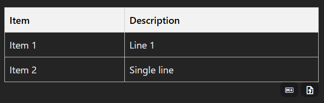

# markdown-it-table-copy

A markdown-it plugin that adds copy buttons to markdown tables, allowing you to copy tables in either markdown or CSV format.

## Features

- Adds copy buttons below markdown tables
- Supports copying in both markdown and CSV formats
- Customizable button and container styles
- Callback functions for copy success and failure events

## Installation

```bash
npm install markdown-it-table-copy
```

## Basic Usage

```javascript
import MarkdownIt from 'markdown-it';
import { markdownitTableCopy } from 'markdown-it-table-copy';

const md = new MarkdownIt();
md.use(markdownitTableCopy);

const result = md.render(`
| Name  | Age | Hobby     |
|-------|-----|-----------|
| Tanaka| 28  | Soccer    |
| Suzuki| 35  | Reading   |
| Sato  | 22  | Guitar    |
`);
```

## Options

The plugin supports various options:

```javascript
md.use(markdownitTableCopy, {
  // Copy functionality settings
  copyMd: true,                // Show markdown format copy button (default: true)
  copyCsv: true,               // Show CSV format copy button (default: true)

  // Style settings
  tableContainerStyle: 'display: grid; grid-template: auto;', // Table container style
  tableContainerClass: '',     // Additional class for table container
  btnContainerStyle: 'justify-self: end; align-self: end;',   // Button container style
  btnContainerClass: '',       // Additional class for button container
  btnStyle: 'cursor: pointer;', // Button style
  btnClass: '',                // Additional class for buttons

  // Button element customization
  mdCopyBtnElement: '<span>md</span>',   // Markdown copy button content
  csvCopyBtnElement: '<span>csv</span>', // CSV copy button content

  // Callback functions
  onSuccess: (e) => {          // Callback on copy success
    console.log('Copy success:', e);
  },
  onError: (e) => {            // Callback on copy failure
    console.error('Copy failed:', e);
  }
});
```

## Icon Usage Example

You can customize buttons using icon libraries like Material Design Icons.

(Make sure the corresponding icon font is installed.)

```javascript
md.use(markdownitTableCopy, {
  mdCopyBtnElement: '<span class="mdi mdi-language-markdown-outline"></span>',
  csvCopyBtnElement: '<span class="mdi mdi-file-delimited-outline"></span>',
});
```

screenshot:



## License

MIT License

## Author

kotaro-miura
